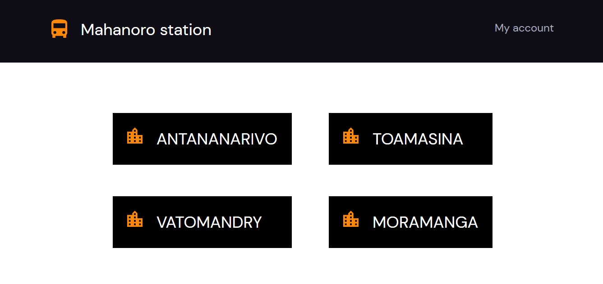

# Graded Project - Mahanoro Station
  
The challenge is to build out this app and get it working with redux, compound components and styled components. This is a website that will allow us to reserve some seats in "Taxi brousses" departing from Mahanoro station.
 
<h1 align="center">Mahanoro Station</h1>

<div align="center">
  <h3>
    <a href="https://mahanoro-station-rinon.netlify.app/"> 
      Demo
    </a>
    <span> | </span>
    <a href="https://github.com/onja-org/mahanoro-station">
      Solution
    </a>
  </h3>
</div>

<!-- TABLE OF CONTENTS -->

## Table of Contents

-   [Overview](#overview)
    -   [Built With](#built-with)
-   [Features](#features)
-   [How to use](#how-to-use)
-   [Contact](#contact)
-   [Acknowledgements](#acknowledgements)

<!-- OVERVIEW -->

## Overview


 
- My demo:
The demo of my project can be seen by clicking [this netlify link](https://mahanoro-station-rinon.netlify.app/">).

- My experience:
I have solidified my knowledge about **Redux, Compound components and Styled-components**.

Fistly, I did not use connect in this project. All are done with hooks.

- The structure of this project:
 I have a few folders in the root foler:
 - The **Action** folder contains all of the actions that are beein dispatched in some files in the **containers** folder.

 - The **Components** folder contains all the components files needed for the **Pages** and the **Containers**.  
    - This components folder is actually divided into a few different folders. Every file in the **containers** folder has their own component folder. The same architecture as the `Netflix clone project`.
    
 - All of the actions are used in the container files and all of the container files are imported in the **Pages** folder. 

 - All of the states are in the **state.js** file with their default values.

-   If I had more time, I would make my code much cleaner and spend more time on the styles. Finishing the account page well and fixing bugs that I have in the booking seats page. I would refactor my code and style it much better.

- I have learned so much about using *redux* with *compound-component*. I wanted to use `react-modal` for the modal but I did not have time. Next time!

- The most challenging part for me is the booking page and the account page.

- Comment:
This is a delicious project. It is challenging but also enjoyable. Thank you very much.


### Built With

<!-- This section should list any major frameworks that you built your project using. Here are a few examples.-->

-   [React](https://reactjs.org/)

## Features

<!-- List the features of your application or follow the template. Don't share the figma file here :) -->

## How To Use

<!-- Example: -->

To clone and run this application, you'll need [Git](https://git-scm.com) with [npm](http://npmjs.com)) installed on your computer. From your command line:

```bash
# Clone this repository
$ git clone https://github.com/your-user-name/your-project-name

# Install dependencies
$ npm install

# Run the app
$ parcel index.html
```
## Contact
<!-- 
-   Website [your-website.com](https://{your-web-site-link}) -->
-   GitHub [ganamavo](https://{github.com/ganamavo})
